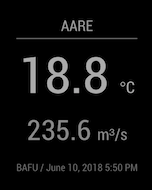

# MMM-AareGuru

*[Lis ds README uf Bärndütsch](README.md).*

MMM-AareGuru allows you to view the [aare.guru](https://aare.guru/) river
temperature on your [MagicMirror²](https://github.com/MichMich/MagicMirror/).




## Installation

```shell
cd ~/MagicMirror/modules
```

Clone the repository:
```shell
git clone https://github.com/buge/MMM-AareGuru
```

Configure the module in your `config.js`:
```js
modules: [
	{
		module: 'MMM-AareGuru',
		position: 'top_right',
		header: 'aare.guru',
		config: {
			city: 'bern',
			forecast: 'vertical',
		}
	},
]
```


## Configuration Options

|      Option      | Description
|------------------|-------------
| city             | Location for which to display the river temperature. Possible options are 'brienz', 'interlaken', 'thun', 'bern', 'hagneck', 'biel' and 'brugg'
| forecast         | Layout to show forecast with ('vertical', 'horizontal' or 'none')
| updateIntervalMs | How often the module should update itself (every 10min by default)
